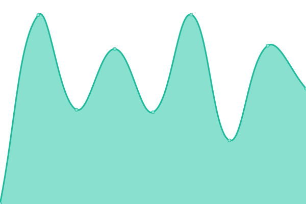

# [📈 Live Status](https://status.ononoki.org): <!--live status--> **🟧 Partial outage**

This repository contains the open-source uptime monitor and status page for [ononoki](https://ononoki.org/), powered by [Upptime](https://github.com/upptime/upptime).

With [Upptime](https://upptime.js.org), you can get your own unlimited and free uptime monitor and status page, powered entirely by a GitHub repository. We use [Issues](https://github.com/ononoki1/status/issues) as incident reports, [Actions](https://github.com/ononoki1/status/actions) as uptime monitors, and [Pages](https://status.ononoki.org) for the status page.

<!--start: status pages-->
<!-- This summary is generated by Upptime (https://github.com/upptime/upptime) -->
<!-- Do not edit this manually, your changes will be overwritten -->
<!-- prettier-ignore -->
| URL | Status | History | Response Time | Uptime |
| --- | ------ | ------- | ------------- | ------ |
|  [Homepage](https://ononoki.org) | 🟥 Down | [homepage.yml](https://github.com/ononoki1/status/commits/HEAD/history/homepage.yml) | 

 782ms
     
 | 

<a href="https://status.ononoki.org/history/homepage">99.96%</a>
    

|  [2048 game](https://2048.ononoki.org) | 🟥 Down | [2048-game.yml](https://github.com/ononoki1/status/commits/HEAD/history/2048-game.yml) | 

 742ms
     
 | 

<a href="https://status.ononoki.org/history/2048-game">99.96%</a>
    

|  [Blog](https://blog.ononoki.org) | 🟥 Down | [blog.yml](https://github.com/ononoki1/status/commits/HEAD/history/blog.yml) | 

 756ms
     
 | 

<a href="https://status.ononoki.org/history/blog">99.97%</a>
    

|  [Comment](https://comment.ononoki.org) | 🟥 Down | [comment.yml](https://github.com/ononoki1/status/commits/HEAD/history/comment.yml) | 

 168ms
     
 | 

<a href="https://status.ononoki.org/history/comment">99.97%</a>
    

|  [Index](https://index.ononoki.org) | 🟥 Down | [index.yml](https://github.com/ononoki1/status/commits/HEAD/history/index.yml) | 

 758ms
     
 | 

<a href="https://status.ononoki.org/history/index">99.98%</a>
    

|  [IP query](https://ip.ononoki.org) | 🟥 Down | [ip-query.yml](https://github.com/ononoki1/status/commits/HEAD/history/ip-query.yml) | 

 750ms
     
 | 

<a href="https://status.ononoki.org/history/ip-query">99.98%</a>
    

|  [MortyProxy](https://morty.ononoki.org) | 🟥 Down | [morty-proxy.yml](https://github.com/ononoki1/status/commits/HEAD/history/morty-proxy.yml) | 

 414ms
     
 | 

<a href="https://status.ononoki.org/history/morty-proxy">99.99%</a>
    

|  [Pastebin](https://paste.ononoki.org) | 🟥 Down | [pastebin.yml](https://github.com/ononoki1/status/commits/HEAD/history/pastebin.yml) | 

 973ms
     
 | 

<a href="https://status.ononoki.org/history/pastebin">99.99%</a>
    

|  [Search](https://search.ononoki.org) | 🟥 Down | [search.yml](https://github.com/ononoki1/status/commits/HEAD/history/search.yml) | 

 374ms
     
 | 

<a href="https://status.ononoki.org/history/search">100.00%</a>
    

|  [URL shortener](https://uurl.cf) | 🟩 Up | [url-shortener.yml](https://github.com/ononoki1/status/commits/HEAD/history/url-shortener.yml) | 

 1667ms
     
 | 

<a href="https://status.ononoki.org/history/url-shortener">100.00%</a>
    

<!--end: status pages-->

[**Visit our status website →**](https://status.ononoki.org)

## 📄 License

- Powered by: [Upptime](https://github.com/upptime/upptime)
- Code: [MIT](./LICENSE) © [ononoki](https://ononoki.org/)
- Data in the `./history` directory: [Open Database License](https://opendatacommons.org/licenses/odbl/1-0/)
