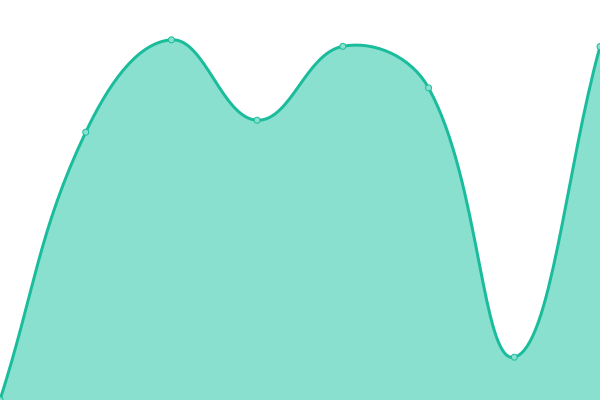

# [📈 Live Status](https://status.ononoki.org): <!--live status--> **🟩 All systems operational**

This repository contains the open-source uptime monitor and status page for [ononoki](https://ononoki.org/), powered by [Upptime](https://github.com/upptime/upptime).

With [Upptime](https://upptime.js.org), you can get your own unlimited and free uptime monitor and status page, powered entirely by a GitHub repository. We use [Issues](https://github.com/ononoki1/status/issues) as incident reports, [Actions](https://github.com/ononoki1/status/actions) as uptime monitors, and [Pages](https://status.ononoki.org) for the status page.

<!--start: status pages-->
<!-- This summary is generated by Upptime (https://github.com/upptime/upptime) -->
<!-- Do not edit this manually, your changes will be overwritten -->
<!-- prettier-ignore -->
| URL | Status | History | Response Time | Uptime |
| --- | ------ | ------- | ------------- | ------ |
|  [DNS](ns1.ononoki.org) | 🟩 Up | [dns.yml](https://github.com/ononoki1/status/commits/HEAD/history/dns.yml) | 

 75ms
     
 | 

<a href="https://status.ononoki.org/history/dns">100.00%</a>
    

|  [Homepage](https://ononoki.org/) | 🟩 Up | [homepage.yml](https://github.com/ononoki1/status/commits/HEAD/history/homepage.yml) | 

 256ms
     
 | 

<a href="https://status.ononoki.org/history/homepage">100.00%</a>
    

|  [2048](https://2048.ononoki.org/) | 🟩 Up | [2048.yml](https://github.com/ononoki1/status/commits/HEAD/history/2048.yml) | 

 266ms
     
 | 

<a href="https://status.ononoki.org/history/2048">100.00%</a>
    

|  [Blog](https://blog.ononoki.org/) | 🟩 Up | [blog.yml](https://github.com/ononoki1/status/commits/HEAD/history/blog.yml) | 

 304ms
     
 | 

<a href="https://status.ononoki.org/history/blog">100.00%</a>
    

|  [Comment](https://comment.ononoki.org/) | 🟩 Up | [comment.yml](https://github.com/ononoki1/status/commits/HEAD/history/comment.yml) | 

 3475ms
     
 | 

<a href="https://status.ononoki.org/history/comment">100.00%</a>
    

|  [Drive](https://drive.ononoki.org/) | 🟩 Up | [drive.yml](https://github.com/ononoki1/status/commits/HEAD/history/drive.yml) | 

 197ms
     
 | 

<a href="https://status.ononoki.org/history/drive">100.00%</a>
    

|  [Index](https://index.ononoki.org/) | 🟩 Up | [index.yml](https://github.com/ononoki1/status/commits/HEAD/history/index.yml) | 

 209ms
     
 | 

<a href="https://status.ononoki.org/history/index">100.00%</a>
    

|  [IP](https://ip.ononoki.org/) | 🟩 Up | [ip.yml](https://github.com/ononoki1/status/commits/HEAD/history/ip.yml) | 

 169ms
     
 | 

<a href="https://status.ononoki.org/history/ip">100.00%</a>
    

|  [Morty](https://morty.ononoki.org/) | 🟩 Up | [morty.yml](https://github.com/ononoki1/status/commits/HEAD/history/morty.yml) | 

 194ms
     
 | 

<a href="https://status.ononoki.org/history/morty">100.00%</a>
    

|  [Paste](https://paste.ononoki.org/) | 🟩 Up | [paste.yml](https://github.com/ononoki1/status/commits/HEAD/history/paste.yml) | 

 198ms
     
 | 

<a href="https://status.ononoki.org/history/paste">100.00%</a>
    

|  [Resume](https://resume.ononoki.org/) | 🟩 Up | [resume.yml](https://github.com/ononoki1/status/commits/HEAD/history/resume.yml) | 

 329ms
     
 | 

<a href="https://status.ononoki.org/history/resume">100.00%</a>
    

|  [Search](https://search.ononoki.org/) | 🟩 Up | [search.yml](https://github.com/ononoki1/status/commits/HEAD/history/search.yml) | 

 210ms
     
 | 

<a href="https://status.ononoki.org/history/search">100.00%</a>
    

|  [Tor](http://107.189.30.115:8080/) | 🟩 Up | [tor.yml](https://github.com/ononoki1/status/commits/HEAD/history/tor.yml) | 

 683ms
     
 | 

<a href="https://status.ononoki.org/history/tor">99.24%</a>
    

<!--end: status pages-->

[**Visit our status website →**](https://status.ononoki.org)

## 📄 License

- Powered by: [Upptime](https://github.com/upptime/upptime)
- Code: [MIT](./LICENSE) © [ononoki](https://ononoki.org/)
- Data in the `./history` directory: [Open Database License](https://opendatacommons.org/licenses/odbl/1-0/)
